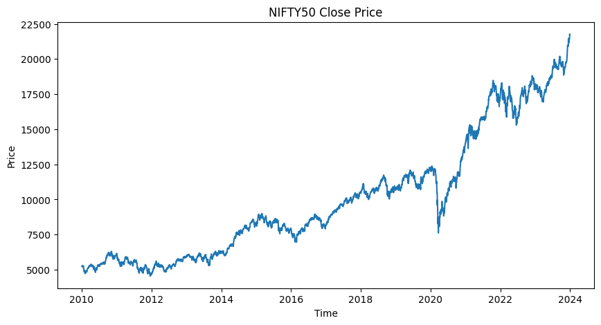
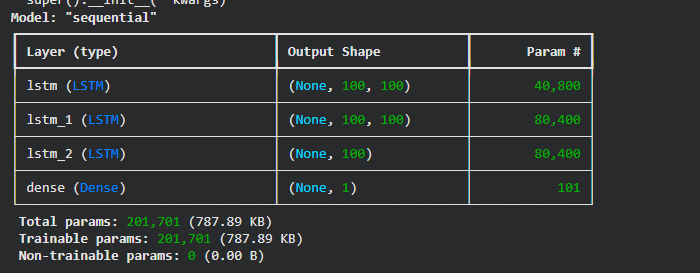
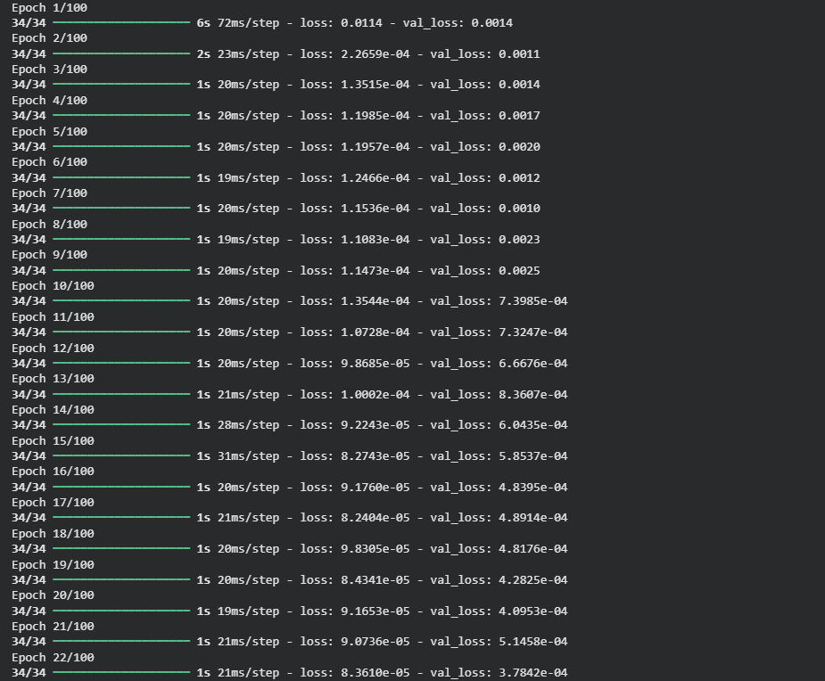
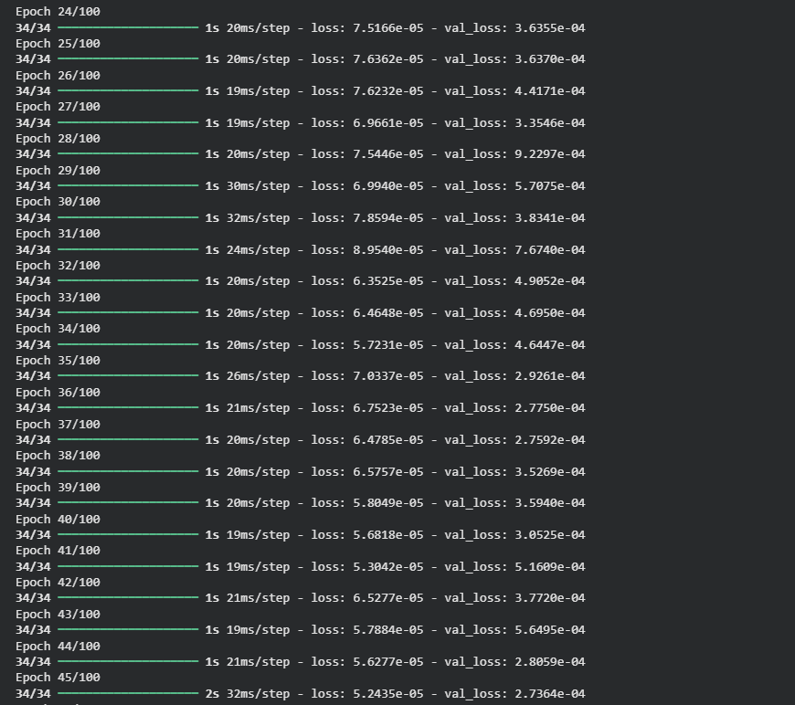
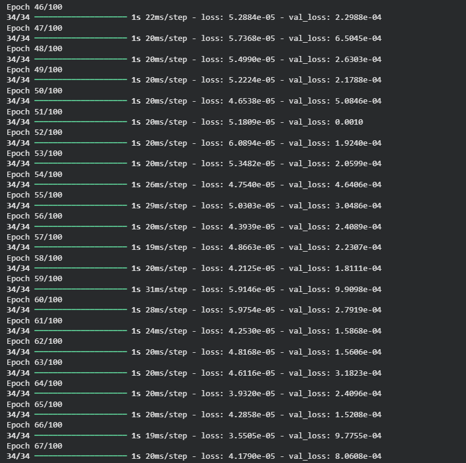
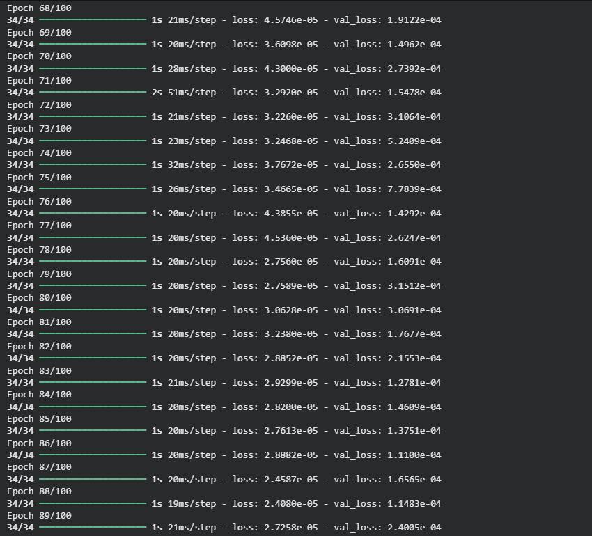
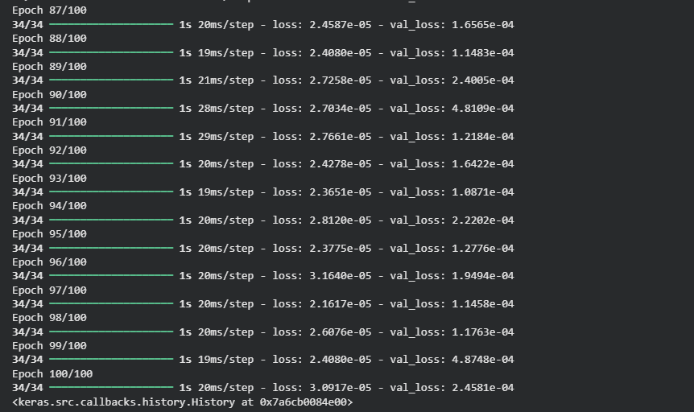
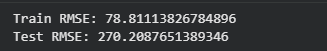
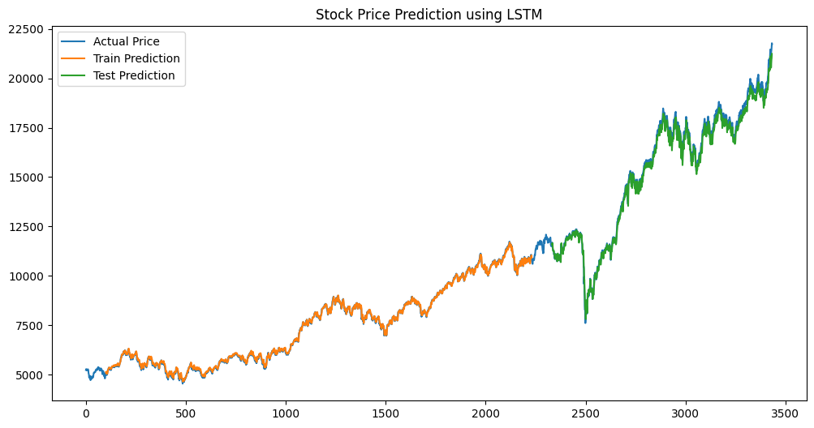

# 📈 NIFTY50 Stock Price Prediction using LSTM

This project predicts **NIFTY50 stock prices** using a **Stacked LSTM (Long Short-Term Memory) neural network** built with TensorFlow/Keras.

The model learns patterns from historical stock market data and predicts future stock closing prices.

---

# 📊 Dataset

The dataset contains historical **NIFTY50 index data** downloaded using the **yfinance** library.

**Time Period:**  
2010 – 2024

**Feature Used**
- Close Price

Dataset file:

```
nifty50_data.csv
```

---

# 📉 NIFTY50 Closing Price Visualization

This graph shows the historical closing price of the NIFTY50 index.



---

# 🧠 Model Architecture

The model uses a **Stacked LSTM architecture**:

- LSTM Layer (100 units)
- LSTM Layer (100 units)
- LSTM Layer (100 units)
- Dense Layer (Output)

Total Parameters: **201,701**



---

# 🏋️ Model Training

The model was trained for **100 epochs** with **batch size = 64**.

Training logs:











---

# 📏 Model Evaluation

Model performance was evaluated using **RMSE (Root Mean Squared Error)**.

**Results**

Train RMSE: **78.81**

Test RMSE: **270.20**



---

# 🔮 Prediction Result

The graph below compares:

- Actual Stock Price
- Training Prediction
- Test Prediction



---

# ⚙️ Technologies Used

- Python
- TensorFlow / Keras
- NumPy
- Pandas
- Matplotlib
- Scikit-learn
- yfinance

---

# 📂 Project Structure

```
NIFTY50_LSTM
│
├── images
│   ├── model_architecture.png
│   ├── NIFTY50_price.png
│   ├── prediction_graph.png
│   ├── rmse_result.png
│   ├── training_log1.png
│   ├── training_log2.png
│   ├── training_log3.png
│   ├── training_log4.png
│   └── training_log5.png
│
├── download_data.py
├── train_model.py
├── nifty50_data.csv
├── requirements.txt
└── README.md
```

---

# ▶️ How to Run the Project

### 1️⃣ Install Dependencies

```
pip install -r requirements.txt
```

### 2️⃣ Download Dataset

```
python download_data.py
```

### 3️⃣ Train the Model

```
python train_model.py
```

---

# 🚀 Future Improvements

- Add technical indicators (RSI, MACD)
- Predict **Buy / Sell / Hold signals**
- Implement reinforcement learning trading strategy
- Deploy the model as a web application

---

# 👨‍💻 Author

**Arpit Kumar Shrivastava**