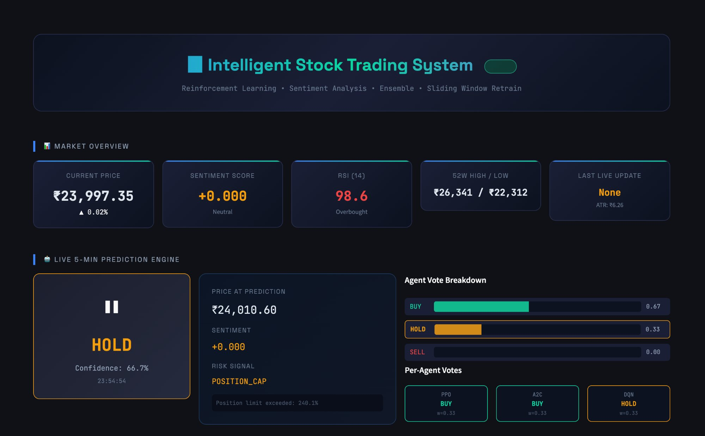
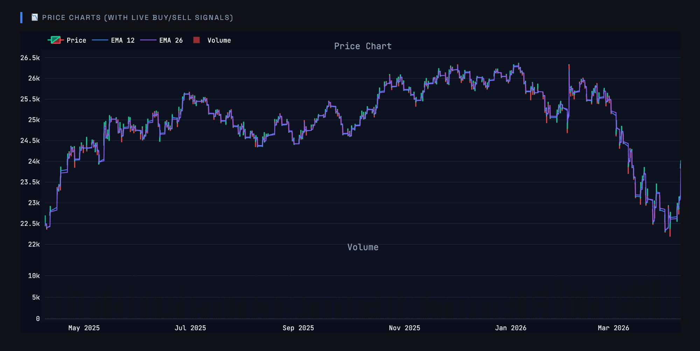

# Intelligent Stock Trading System

> *Reinforcement Learning · Sentiment Analysis · Ensemble · Sliding Window Retrain*

---

## 👥 Team

| Name | Role |
|------|------|
| **Arpit Kumar Shrivastava** | ML / RL Engineering |
| **Arihant Jain** | Backend & API |
| **Anurag Yadav** | Data Pipeline & Feature Engineering |
| **Anupam** | Frontend & Dashboard |
| **Arpit Goyal** | Model Training & Evaluation |

---

## 📸 Screenshots

### Live Dashboard — Market Overview & Prediction Engine


### Price Chart with EMA Indicators & Buy/Sell Signals



---

An end-to-end Reinforcement Learning pipeline that fetches live market data, engineers technical features, scores financial news sentiment via FinBERT, and runs a four-agent ensemble (PPO, DQN, DDQN, A2C) to recommend **BUY / HOLD / SELL** on every 5-minute candle — with a risk management layer and a live Streamlit dashboard.

---

## System Flow

```
Yahoo Finance / CSV Cache
         │
         ▼
┌─────────────────┐
│  Data Loader    │  ← yfinance API + 5-min cache + long intraday fallback builder
└────────┬────────┘
         │  OHLCV DataFrame
         ▼
┌─────────────────┐
│ Feature Engineer│  ← RSI · MACD · EMA · Bollinger Bands · ATR
└────────┬────────┘
         │  feature-enriched DataFrame
         ▼
┌─────────────────┐
│ Sentiment Layer │  ← NewsAPI → FinBERT (ProsusAI/finbert) → score ∈ [-1, +1]
└────────┬────────┘
         │  sentiment_score appended to state vector
         ▼
┌─────────────────┐
│ Trading Env     │  ← Gymnasium custom env: balance, shares_held, P&L, reward
└────────┬────────┘
         │  observation (state_dim = features + sentiment)
         ▼
┌─────────────────────────────────────────┐
│            Ensemble Engine              │
│  ┌───────┐ ┌───────┐ ┌──────┐ ┌─────┐  │
│  │  PPO  │ │  DQN  │ │ DDQN │ │ A2C │  │
│  │ 0.30  │ │ 0.20  │ │ 0.20 │ │0.30 │  │
│  └───────┘ └───────┘ └──────┘ └─────┘  │
│         weighted-vote → final action    │
└────────┬────────────────────────────────┘
         │  action: BUY / HOLD / SELL
         ▼
┌─────────────────┐
│  Risk Manager   │  ← stop-loss · max drawdown · position cap · overtrading guard
└────────┬────────┘
         │  approved / overridden action
         ▼
┌─────────────────┐
│  Live Predictor │  ← runs every 5 minutes, logs PredictionResult to JSON
└────────┬────────┘
         │
         ▼
┌─────────────────┐
│ Streamlit Dashboard │  ← candlestick chart · live action · confidence · P&L
└─────────────────┘
```

---

## Modules

### Data Loader (`src/data_loader.py`)

Fetches OHLCV data from Yahoo Finance and manages a local CSV cache.

| Behaviour | Detail |
|-----------|--------|
| Cache TTL | ~5 minutes — stale data triggers a fresh API call |
| Long intraday | Yahoo does not serve 2y + 5m directly; the loader builds it from daily history + recent intraday and stitches them |
| Fallback | If API fails, loads from the bundled CSV files in `src/data/` |
| Key method | `StockDataLoader.load(ticker, period, interval, force_download)` |

---

### Feature Engineering (`src/features.py`)

Computes five families of technical indicators on top of raw OHLCV data.

| Indicator | Window | Signal |
|-----------|--------|--------|
| RSI | 14 | Momentum — overbought > 70, oversold < 30 |
| MACD | 12 / 26 / 9 | Trend — crossover for entry / exit |
| EMA | 12, 26 | Trend — dynamic price direction |
| Bollinger Bands | 20, ±2σ | Volatility — band breakout detection |
| ATR | 14 | Volatility — used for position sizing and stop-loss |

All indicators are computed via the `ta` library or manual NumPy/Pandas implementations.

---

### Sentiment Analysis (`src/sentiment.py`)

Fetches financial news headlines for a ticker and converts them into a scalar sentiment score using **FinBERT** (ProsusAI/finbert).

```
NEWS SOURCES (NewsAPI / RSS / Fallback Headlines)
      ↓
PREPROCESSING (tokenize, clean, lowercase)
      ↓
FinBERT: POSITIVE → +1 · NEGATIVE → -1 · NEUTRAL → 0
      ↓
AGGREGATED SCORE: weighted average → float ∈ [-1.0, +1.0]
      ↓
STATE INJECTION: state[..., -1] = sentiment_score
```

Results are cached to `src/data/sentiment_cache.json` to avoid redundant API calls and inference runs (default refresh: 60 minutes).

---

### Trading Environment (`src/env.py`)

A custom **Gymnasium** environment that simulates a single-stock trading session.

| Property | Value |
|----------|-------|
| Action space | Discrete(3) — HOLD, BUY, SELL |
| Observation | Feature vector + sentiment score (normalized) |
| Initial balance | ₹10,000 |
| Transaction cost | 0.1% per trade |
| Overtrading penalty | 0.2% when max trades/episode exceeded |
| Reward scaling | 1e-4 |

---

### RL Agents & Training (`src/train_dqn.py`, `src/train_ppo.py`, `src/train_all.py`)

Four agents are trained in sequence by `train_all.py`:

| Agent | Library | Notes |
|-------|---------|-------|
| **DQN** | stable-baselines3 | Replay buffer 50k, exploration fraction 0.2 |
| **DDQN** | custom PyTorch | Soft target updates (τ = 0.005), replay buffer 50k |
| **PPO** | stable-baselines3 | n_steps 2048, 10 epochs, clip range 0.2 |
| **A2C** | stable-baselines3 | n_steps 5 |

Default training: **600,000 timesteps** on 2 years of 5-minute bars. Trained models are saved as `.zip` / `.pt` files in `src/models/`.

---

### Ensemble Engine (`src/ensemble.py`)

Combines the four agents via a weighted-vote mechanism.

**Default weights:**

| PPO | DQN | DDQN | A2C |
|-----|-----|------|-----|
| 0.30 | 0.20 | 0.20 | 0.30 |

Weights are normalized at runtime to handle any agent that fails to load. After every sliding-window retrain, updated weights are persisted to `src/models/ensemble_weights.json`.

---

### Risk Manager (`src/risk_manager.py`)

Guards every ensemble decision before execution.

| Rule | Threshold |
|------|-----------|
| Stop-loss | 5% loss on current position |
| Max drawdown | 15% from portfolio peak |
| Position cap | 10% of total portfolio value |
| Max trades/day | 5 trades |

Risk signals: `OK · STOP_LOSS · MAX_DRAWDOWN · POSITION_CAP · OVERTRADING`

---

### Live Predictor (`src/predictor.py`)

Stateful 5-minute prediction engine that ties everything together.

Each prediction cycle produces a `PredictionResult`:

```python
{
    "timestamp":      "2025-04-08T15:30:00",
    "ticker":         "^NSEI",
    "current_price":  22341.50,
    "final_action":   1,           # BUY
    "action_name":    "BUY",
    "confidence":     0.72,
    "sentiment_score": 0.34,
    "risk_signal":    "OK",
    "risk_reason":    "",
    "agent_votes":    {"ppo": 1, "dqn": 1, "ddqn": 0, "a2c": 1},
    "vote_scores":    {"ppo": 0.30, "dqn": 0.20, "ddqn": 0.0, "a2c": 0.30}
}
```

All results are appended to `src/data/predictions_log.json`.

---

### Live Feed (`src/live_runner.py`)

Background data refresh scheduler + optional Socket.IO push server.

| Component | Purpose |
|-----------|---------|
| `DataRefreshScheduler` | Polls Yahoo Finance every 5 minutes per subscribed ticker |
| `SocketIOServer` | Pushes latest OHLCV row to connected browser clients in real time |
| Heartbeat | Periodic keep-alive ping to maintain WebSocket connections |

Socket.IO is optional — the system runs fully without it if `python-socketio` / `eventlet` are not installed.

---

### Sliding-Window Retrainer (`src/retrain.py`)

End-of-day retraining that keeps models fresh without full retraining.

- Triggers when ≥ 20 new bars have arrived since last retrain
- Trains on the most recent **2,000 bars** (sliding window)
- Runs **20,000 timesteps** per agent — much faster than initial training
- Automatically updates ensemble weights in `ensemble_weights.json` after retrain
- State (last trained bar, timestamp, metrics) persisted in `src/data/retrain_state.json`

---

### Backtester (`src/backtest.py`)

Evaluates any trained agent against held-out data.

**Metrics computed:** total return, Sharpe ratio (risk-free rate 6%), max drawdown, win rate, profit factor, average trade P&L.

A **Buy & Hold baseline** is always computed alongside the agent for comparison.

Target Sharpe: ≥ 1.0 (minimum acceptable: 0.5).

---

### Streamlit Dashboard (`src/app.py`)

Full-screen interactive trading terminal.

- Live candlestick + volume chart (Plotly)
- Current BUY / HOLD / SELL signal with confidence badge
- Portfolio metrics: balance, P&L, drawdown, trade count
- Per-agent vote breakdown
- Sentiment score gauge
- Auto-refresh every 5 minutes via `streamlit-autorefresh`

---

## Models (not in repo — generated by training)

| File | Architecture | Trained by |
|------|-------------|------------|
| `src/models/ppo_stock.zip` | PPO (stable-baselines3) | `train_ppo.py` |
| `src/models/dqn_stock.zip` | DQN (stable-baselines3) | `train_dqn.py` |
| `src/models/ddqn_stock.pt` | Double DQN (custom PyTorch) | `train_dqn.py` |
| `src/models/a2c_stock.zip` | A2C (stable-baselines3) | `train_ppo.py` |
| `src/models/ensemble_weights.json` | Weight config | Updated by `retrain.py` |

---

## Running

```bash
# 1. Install dependencies (Python 3.10+)
pip install -r requirements.txt

# 2. Set API keys
cp .env.example .env
# Edit .env → NEWSAPI_KEY=your_key_here (optional — system works without it)

# 3. Initial training (one-time setup)
python src/train_all.py --ticker ^NSEI --timesteps 100000

# 4. Launch the dashboard
streamlit run src/app.py

# 5. End-of-day retrain (run after market close)
python src/train_all.py --ticker ^NSEI --retrain
```

### Quick test run (no GPU needed)

```bash
python src/train_all.py --ticker ^NSEI --timesteps 50000 --quick
```

---

## Configuration

All parameters live in `src/config.py`. Nothing is hardcoded elsewhere.

```python
config.data.default_ticker        # "^NSEI"
config.env.initial_balance        # 10_000.0
config.env.transaction_cost       # 0.001 (0.1%)
config.risk.stop_loss_pct         # 0.05 (5%)
config.risk.max_drawdown_pct      # 0.15 (15%)
config.train.timesteps            # 600_000
config.retrain.window_size        # 2_000 bars
config.retrain.retrain_timesteps  # 20_000
config.ensemble.weights           # {ppo: 0.30, dqn: 0.20, ddqn: 0.20, a2c: 0.30}
```

---

## Project Structure

```
Stock_prediction-main/
├── src/
│   ├── app.py              # Streamlit dashboard (entry point)
│   ├── config.py           # All configuration parameters
│   ├── data_loader.py      # yfinance fetch + CSV cache
│   ├── features.py         # Technical indicator engineering
│   ├── sentiment.py        # FinBERT news sentiment scoring
│   ├── env.py              # Custom Gymnasium trading environment
│   ├── train_dqn.py        # DQN + DDQN training
│   ├── train_ppo.py        # PPO + A2C training
│   ├── train_all.py        # Master training script
│   ├── ensemble.py         # Weighted-vote ensemble engine
│   ├── predictor.py        # 5-minute live prediction cycle
│   ├── live_runner.py      # Background data scheduler + Socket.IO
│   ├── retrain.py          # Sliding-window end-of-day retrainer
│   ├── backtest.py         # Agent evaluation + Buy & Hold baseline
│   ├── risk_manager.py     # Stop-loss / drawdown / position guardrails
│   ├── universe.py         # Nifty 50 ticker list
│   ├── logger.py           # Centralized logging setup
│   ├── data/               # CSV cache + prediction log + retrain state
│   ├── models/             # Saved agent weights + ensemble config
│   └── logs/               # Runtime logs
└── requirements.txt
```

---

## Key Design Decisions

**Why four agents instead of one?** No single RL algorithm dominates across all market regimes. PPO and A2C are policy-gradient methods that handle continuous action probabilities well; DQN and DDQN are value-based and tend to be more conservative. Ensembling reduces variance and avoids the failure modes of any individual agent.

**Why FinBERT and not a general LLM?** FinBERT is fine-tuned specifically on financial text (Reuters, Bloomberg, SEC filings). For three-class financial sentiment classification it outperforms general-purpose models while being much lighter to run locally.

**Why a custom Gymnasium env rather than an off-the-shelf trading gym?** Full control over reward shaping (overtrading penalty, transaction costs, reward scaling), observation construction (feature vector + sentiment injection), and episode dynamics (max trades/episode, normalization stats).

**Why sliding-window retrain instead of full retrain?** Full retraining at 600k timesteps takes significant time and compute. The sliding window approach retains the most recent 2,000 bars and runs 20k timesteps — enough to adapt to recent market behaviour overnight without the cost of training from scratch.

**Why is `travel_time = 1e9` used for blocked positions?** Mirroring the routing philosophy: deleting an edge can disconnect the graph. Setting an extreme penalty lets the optimizer still find a path but strongly prefer any unblocked alternative.
